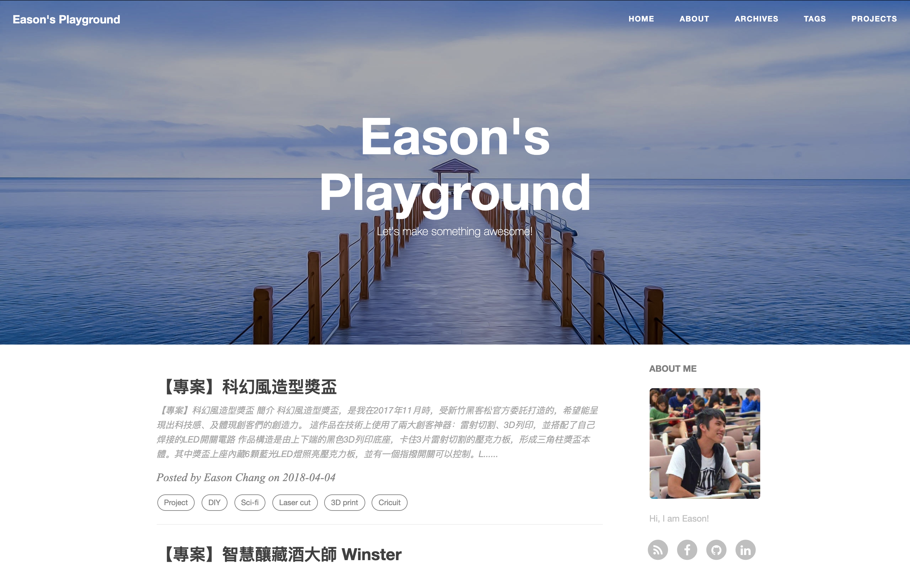
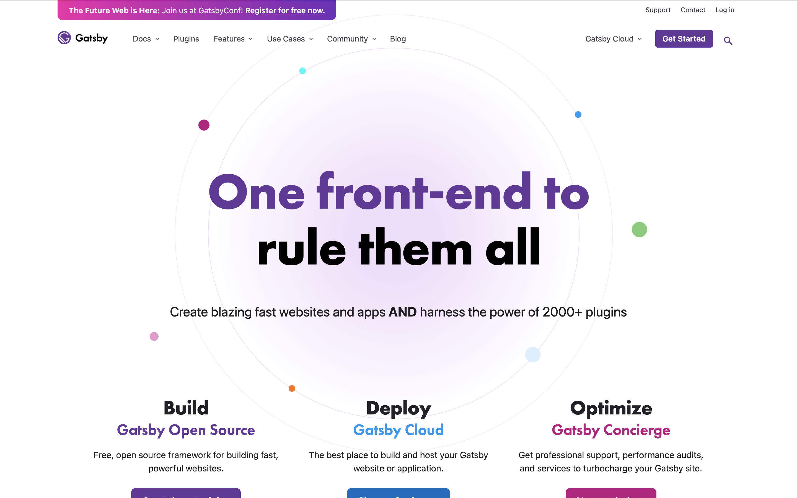
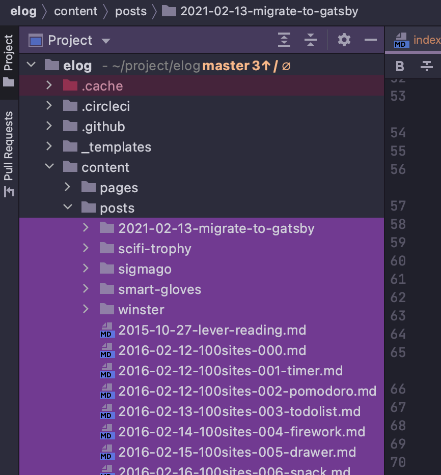
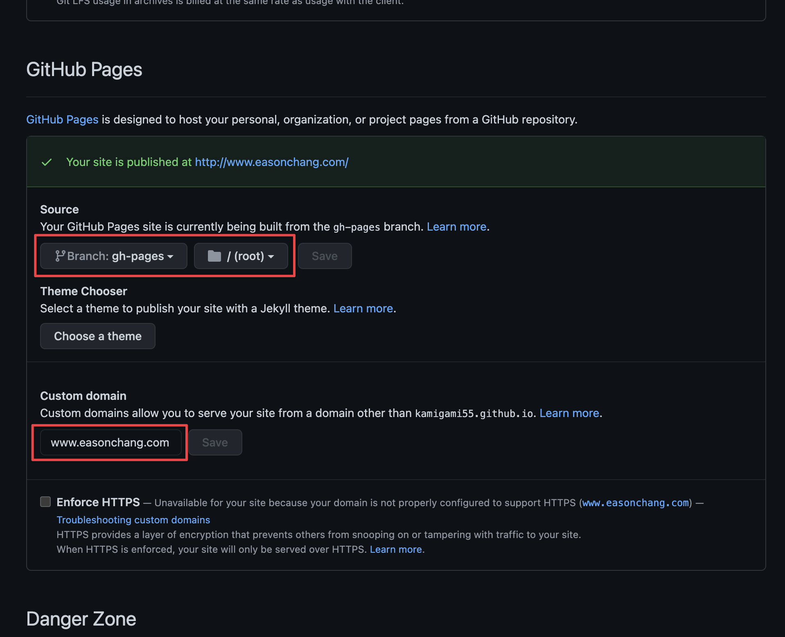
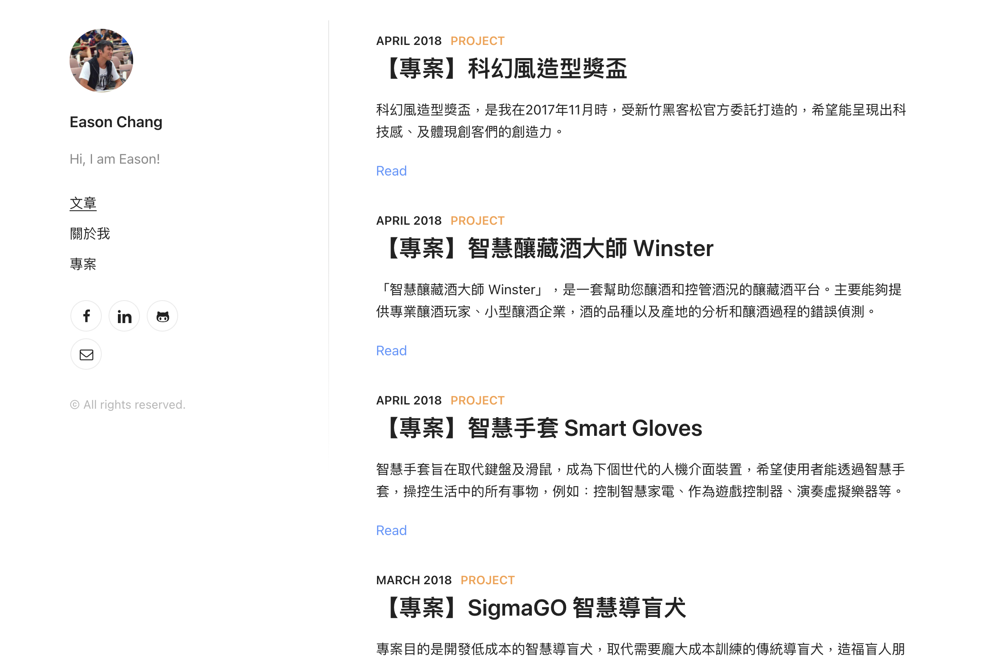

## 為何要改用 Gatsby.js 架構

我從2015年左右開始寫部落格，一開始是開在 [Logdown](https://logdown.com/) 平台上，後來因為它停止維護了，於是改用 [Hexo](https://hexo.io/zh-tw/) 自己建，並託管在 Github Pages 上。



而現在會想改架構原因如下：

1. 前陣子因為在忙畢業和當兵，好一陣子沒更新部落格了，而且又換了新筆電，舊的 Hexo 設定要花時間重新熟悉
2. 這兩年都在玩 React.js，一直很想用 [Gatsby.js](https://www.gatsbyjs.com/) 這套基於 React.js 的靜態網頁生成框架來做點什麼
3. 當完兵過年期間閒得蛋疼，想學點新技術恢復開發手感

於是決定用 Gatsby.js 來重架部落格啦！



---

## 搬遷過程

之前用 Hexo 時，30篇文章是 Markdown 格式的 .md 檔，檔案都還留著，而 Gatsby.js 也支援使用 .md 檔來生成靜態頁面，和 Hexo 的運作邏輯基本一致。

因此搬遷流程不會太複雜：

1. 用 Gatsby 建立新專案
2. 把 30 個文章 .md 檔移過去
3. 調整新部落格設定（樣式、頁面配置、Domain設定等）
4. 生成靜態頁面再丟上 Github Pages，就算是搬遷完成了

### 1. 用 Gatsby 建立新專案

這部分我卡最久，主要是 Gatsby 生態圈太大，有太多方式可以建立起一個 Gatsby 網站，很多選擇需要決定。

我不想花太多時間在搬遷，而是想專注在寫文章，但因為我後續想要深度客製化我的部落格，所以花了不少時間在思考各個方案：

1. 自己架、或是託管在 Gatsby Cloud 上？ **自己架，比較容易客製化，也不用花錢**
2. 需不需要 CMS？要的話要哪套？ **先不用，CMS 我不熟，研究起來沒完沒了，先成功搬遷我 30 篇文章即可**
3. 靜態檔要 Host 在哪裡？ **Github Pages，之前就是在這裡，用起來很舒服、穩定，沒有理由換**
4. 要從頭開始建 Gatsby 專案，還是從 starter 專案開始？ **找 starter 專案開始，想趕快搬遷完成，從頭建太慢**

於是我瀏覽了 Gatsby 的 [starter 列表](https://www.gatsbyjs.com/starters/) ，找了下面這套順眼的樣板開始建專案：

[gatsby-starter-lumen
](https://www.gatsbyjs.com/starters/alxshelepenok/gatsby-starter-lumen/)


按照裡面的教學建立起了專案：

```bash
yarn global add gatsby-cli # 若沒 gatsby-cli 的話，才須先安裝

gatsby new my-blog https://github.com/alxshelepenok/gatsby-starter-lumen

cd my-blog
gatsby develop # 啟動 local server
```

跑完後就可以用瀏覽器開 `http://localhost:8000` 在自己電腦上看到新部落格了

### 2. 把 30 個文章 .md 檔移過去

把 .md 檔放到新專案的 **/content/posts/** 底下 



然後調整各文章的 metadata，符合新專案的命名和格式，重點是 draft 要設成 false，才能看到文章！


### 3. 調整新部落格設定（樣式、頁面配置、Domain設定等）

再來就是調整細部內容成我想要的樣子，部落格 title、社群連結、網址、Disqus連結、favicon 等，主要是調整 **config.js**：

```js
'use strict';

module.exports = {
  url: 'https://www.easonchang.com',
  pathPrefix: '/',
  title: 'Eason\'s Playground - blog by Eason Chang',
  subtitle: 'Let\'s make something awesome!\n',
  copyright: '© All rights reserved.',
  disqusShortname: 'xxxxxxxxxxxxx',
  postsPerPage: 10,
  googleAnalyticsId: 'G-XXXXXXXXX',
  useKatex: false,
  menu: [
    {
      label: '文章',
      path: '/'
    },
    {
      label: '關於我',
      path: '/pages/about'
    },
    {
      label: '專案',
      path: '/pages/projects'
    }
  ],
  author: {
    name: 'Eason Chang',
    photo: '/bio-img.jpeg',
    bio: 'Hi, I am Eason!',
    contacts: {
      email: 'eason@easonchang.com',
      facebook: 'chang.ying.hsiang',
      telegram: '',
      twitter: '',
      github: 'Kamigami55',
      rss: '',
      vkontakte: '',
      linkedin: 'easonchang101',
      instagram: '',
      line: '',
      gitlab: '',
      weibo: '',
      codepen: '',
      youtube: '',
      soundcloud: '',
      medium: '',
    }
  }
};
```

### 4. 生成靜態頁面再丟上 Github Pages，就算是搬遷完成了

我原本的 Hexo 部落格就是架在 Github Pages 上，repo 是 [Kamigami55/Kamigami55.github.io](https://github.com/Kamigami55/Kamigami55.github.io) ，網址會是 [Kamigami55.github.io](https://Kamigami55.github.io) 。

另外原本就還有在 GoDaddy 上買網域指向這個位置，所以部落格最終網址會是
[https://www.easonchang.com/](https://www.easonchang.com/) 。

而我現在做的動作是把舊 repo 改名封存，重開一個新的 **Kamigami55/Kamigami55.github.io** repo，並把剛剛編輯好的 gatsby 專案 push 到 master branch 存放原始碼。

然後在終端機執行以下指令，建立新部落格的靜態檔，並會自動 push 到 gh-pages branch。

```bash
yarn deploy
```

最後在 Github repo 設定頁開啟 Github Pages 功能，按照下圖的方式設定：



就可以看到全新的部落格上線了！

[https://www.easonchang.com/](https://www.easonchang.com/)



---

## Troubleshooting

### 調整每頁的顯示的文章數量

我找的模板預設每頁只顯示 4 篇文章，實在太少了，我想改成每頁顯示 10 篇文章。**config.js** 內有 **postsPerPage** 參數可以直接調整，但調了以後無效。

研究了大半天後發現應該是 gatsby 傳遞 context 時 type 沒有設定到，需要修改 **/src/types/index.js**：

```js
// ...
export type PageContext = {
  tag: string,
  category: string,
  currentPage: number,
  prevPagePath: string,
  nextPagePath: string,
  hasPrevPage: boolean,
  hasNextPage: boolean,
  postsLimit: number // <--- add this
};
// ...
```

我有在 [這個 issue](https://github.com/alxshelepenok/gatsby-starter-lumen/issues/660#issuecomment-778575664) 回覆一些想法，研究更清楚後若確定是個 bug，會發 PR 把它修掉。

---

## 心得＆未來方向

整個搬遷花了我一整天的時間，以前的設定太久沒碰，又沒有寫文章記錄，真的會忘光光，很浪費之前投入的時間，於是這次決定一定要寫文章紀錄自己搬遷的流程，給未來的自己備忘。

未來應該還會寫很多部落格調校文章，還有很多東西想修改，像是深度客製化樣式、加入 GA 追蹤、深色主題、文章編輯流程優化等，期待後續的發展！
