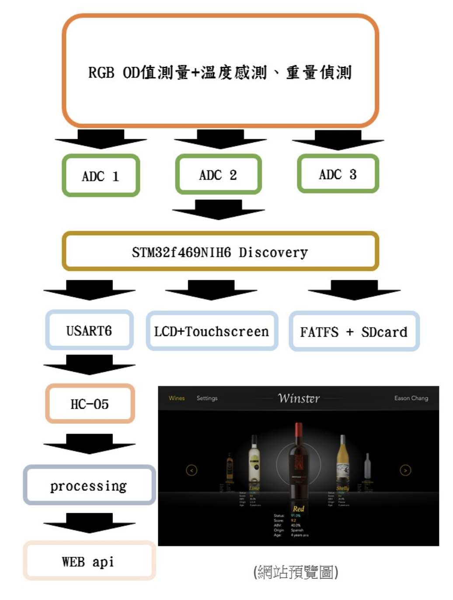
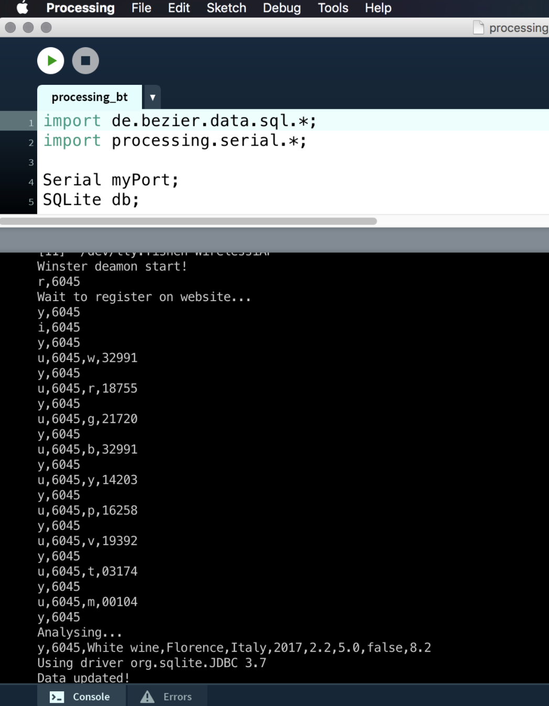

## 簡介

**「智慧釀藏酒大師 Winster」**，是一套幫助您釀酒和控管酒況的釀藏酒平台。

主要能夠提供專業釀酒玩家、小型釀酒企業，酒的品種以及產地的分析和釀酒過程的錯誤偵測，同時在網頁與行動裝置上指示用戶，註冊、偵測並顯示相關資訊，並紀錄之，亦可對於單純收藏酒的一般用戶提供酒況偵測與建議。

技術上透過光學、溫度、濕度和重量感測，以及背後的數據收集，利用 RNN 的機器學習架構，採用 LSTM 來分析原始資料。

我們特地實地收集了五十幾種的酒種，並且研究諸多相關論文，利用偵測值（RGB的OD值、溫度、濕度、重量實時變化）與口感的關係，再利用自製的偵測電路和3D列印外殼，實現了Winster的硬體裝置。

這項作品拿到了 **[2017 ARM Design Contest](http://www.armdesigncontest.com/customers/login/) 決賽入圍**，以及 **[第2屆遠傳物聯網應用開發大賽](http://promotion.fetnet.net/ebu/2017IoTHackathon/index.html)的 Ericsson 企業獎**。

## Demo 影片

<iframe width="560" height="315" src="https://www.youtube-nocookie.com/embed/KtZpLWXkcy4" frameborder="0" allow="accelerometer; autoplay; clipboard-write; encrypted-media; gyroscope; picture-in-picture" allowfullscreen></iframe>

## 系統架構

系統架構圖：

### 硬體

STM32F469NIH6程式碼：[ericz7000nolan/Arm-contest](https://github.com/ericz7000nolan/Arm-contest)

一、自製電壓偵測模組：以電阻值反比於亮度(正比於電阻倒數)的形式進行測量。欲量得光譜值、溫度、重量的值，須先測得其電阻，另外串連一個適當電阻，測其跨壓，來得出酒況，進而得出口感和相關產地。

二、ADC1 ADC2、ADC3 :測量待測電壓訊號經過後，將轉換結果換算成實際的電壓值，供電路使用，並且供server做計算。

三、將LCD screen 和 touchscreen 做啟用，提升使用者與作品的親切度，並能透過LCD介面選擇模式。

四、STM32F469NIH6 Discovery Board 我們主要實現了以下:功能 USART、ADC、delay、按鍵中斷、LED 控制、LCD、touchscreen、FATFS。

五、在此作品中，STM32F469NIH6 Discovery 開發板作為數據偵測與初階處理的工作(ADC 數據作 Moving Average 100 點)，並將結果透過 USART 傳給藍芽模組，USART 與 HC05 藍芽模組透過板上的 USART6，傳送資料給藍芽模組 HC05，藍芽模組再將資料傳送給主機方， 主機方接收後會開始進行即時數據分析。

Winster裝置成品：

### 資料處理

我們利用RGB三色LED裝設於裝置上，並使其能貼於酒瓶兩側，利用LED燈光之變化：分別以紅、黃、藍、綠、青、紫、白光去照射酒瓶，並於另一端的光敏電阻接收光值，並去分析不同酒種對於光值的變化情形來做酒種的識別與判斷。

我們共分析了50支酒的光值，分別為8支威士忌、2支調和威士忌、4支伏特加、1支萊姆酒、3支龍舌蘭酒、3支琴酒、1支粉紅酒、1支紅酒與27支白酒。

而我們發現光譜值透過分析後，可將其與酒之間的差異分離出來，並且觀察到綠光的部分造成的影響最大，且差異性可和酒種的body(口感，像是medium body、full body 等等)做連結，進而判斷出酒種的body和可能產地，再者，偵測到待測物的原始資料後，利用酒類的各色吸光OD值來對酒類的酒種、酒體、釀造氣候等等，與資料庫的數據進行迴歸分析的mapping，再取出最相近的酒種，然後對差異性高低做分數評比(在server上做分析)，並回傳結果給板子。

### 軟體

主機上使用Processing接收Winster裝置藍芽傳進來的資料（各色光穿透率、溫度、重量），將此筆資料與SQLite3資料庫中所有酒類data進行回歸分析比對，找出最相近的酒種，然後回傳回device上顯示，同時將此筆新資料加入資料庫中，擴展資料量，讓下次比對結果更準確。

網頁前端使用HTML, CSS, Javascript, JqueryUI來實現互動式介面。

網頁後端使用Ruby on Rails做為開發框架，並用SQLite3作為資料庫。

使用者連線上主機後，Rails會直接抓取資料庫中已經分析比對好的結果，呈現在網頁上。
而若使用者是專業釀酒師，在實際品酒後認為網頁呈現的結果有偏差（年份、酒體有誤差等等），也可以手動更改回歸分析的結果，而這筆更動也會即時寫進資料庫裡，提升整體比對結果準確率。

網頁程式碼：[Kamigami55/winster-web](https://github.com/Kamigami55/winster-web)

網頁介面（首頁）：

網頁介面（酒藏詳細資訊）：

## 相關媒體報導

- [培育IoT新創團隊邁向國際舞台 遠傳扮推手 - Yahoo奇摩新聞](https://tw.news.yahoo.com/%E5%9F%B9%E8%82%B2iot%E6%96%B0%E5%89%B5%E5%9C%98%E9%9A%8A%E9%82%81%E5%90%91%E5%9C%8B%E9%9A%9B%E8%88%9E%E5%8F%B0-%E9%81%A0%E5%82%B3%E6%89%AE%E6%8E%A8%E6%89%8B-084206839.html)

## 專案成員

Eason Chang、Eric Chang、Michael Chen